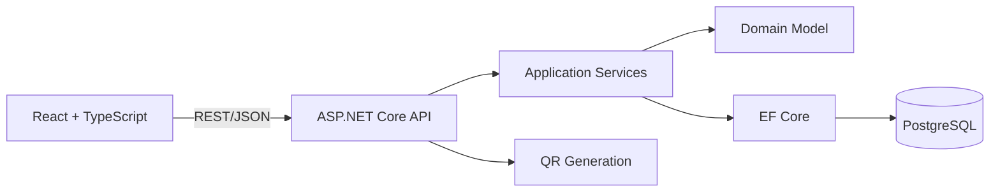
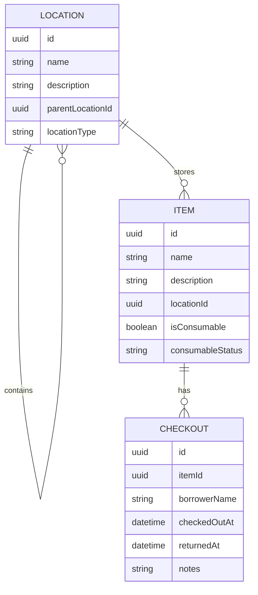

# Toolbox

> A self-hosted inventory system that tells you exactly where your things are.

Toolbox brings structure to household, workshop, and equipment storage. It
models real spaces as a hierarchy, connects every item to a precise location,
and records when an item leaves its usual home.

Instead of remembering that a torque wrench is "somewhere in the garage",
Toolbox gives a useful answer:

```text
House / Garage / Red Tool Chest / Drawer 2
```

The project is designed as a production-minded full-stack application with an
ASP.NET Core API, a React and TypeScript client, PostgreSQL persistence, and a
reproducible Docker Compose deployment.

> [!IMPORTANT]
> Toolbox is currently in pre-release development. The product specification
> and architecture are complete; application scaffolding and the first vertical
> slice are the next delivery milestone. See [Project status](#project-status)
> for the current scope.

## Why Toolbox?

Generic inventory tools can record what you own, but they rarely model where
an object is stored with enough precision to help you find it. Toolbox treats
physical location as a core domain concept rather than a free-text field.

- **Find items quickly:** search by name or description and see the complete
  storage path in each result.
- **Add ranges quickly:** create numbered sets such as `mm 1/4" sockets 10`
  through `mm 1/4" sockets 24` in one operation.
- **Model real spaces:** nest rooms, cabinets, shelves, boxes, and drawers to
  any depth.
- **Keep locations accurate:** move items and locations without rebuilding the
  surrounding hierarchy.
- **Track borrowed equipment:** check an item out to a named borrower and keep
  its full return history.
- **Label physical storage:** generate a stable QR code that opens a location
  and its contents on a phone.
- **Own the data:** run the complete system on infrastructure you control.

## Core Workflows

### Locate an item

Search is the primary interaction. A result combines item details, availability,
and a calculated path through the location tree so the user can move directly
from a query to the physical object.

```text
Torque Wrench
Available | Consumable: no
House / Garage / Red Tool Chest / Drawer 2
```

### Organise a space

Locations use an arbitrary parent-child hierarchy. The model works equally well
for a single storage cupboard or a collection spanning a house, garage, loft,
and workshop. Items can be reassigned as the physical space changes.

### Check equipment out

A checkout records the borrower, time, and optional context. Returning the item
closes the active checkout rather than deleting it, preserving an auditable
history while making the item available again.

### Open a labelled location

Every location has a stable URL. Its generated QR code can be attached to a
box, cabinet, or drawer and scanned to open that location's current contents.

## Architecture

Toolbox uses a modular monolith. This keeps deployment and local development
simple while preserving explicit boundaries between the API, application
logic, domain model, and infrastructure.



The backend owns business rules such as hierarchy validation, path calculation,
item availability, and checkout state transitions. The frontend is responsible
for responsive search, browsing, and task-focused item and location workflows.

### Technology

| Area | Technology |
| --- | --- |
| API | C# and ASP.NET Core |
| Domain and persistence | Entity Framework Core |
| Web client | React, TypeScript, and Vite |
| Database | PostgreSQL |
| Backend tests | xUnit |
| Deployment | Docker and Docker Compose |

### Repository layout

The current foundation follows this structure:

```text
toolbox/
|-- backend/
|   |-- src/             # API, application, domain, and persistence
|   `-- tests/           # Unit and integration tests
|-- frontend/            # React application
|-- docs/                # Product and technical documentation
|-- docker-compose.yml
|-- .env.example
`-- README.md
```

## Domain Model



- A **Location** represents a physical space and may contain child locations
  and items.
- An **Item** belongs to one current location and exposes its calculated full
  location path.
- A **Checkout** is an append-only record. An item may have at most one active
  checkout, while completed records remain available as history.

## API Design

The first release is defined around resource-oriented REST endpoints with
explicit commands for checkout state transitions.

| Method | Endpoint | Purpose |
| --- | --- | --- |
| `GET` | `/api/locations` | List locations |
| `POST` | `/api/locations` | Create a location |
| `GET` | `/api/locations/tree` | Retrieve the location hierarchy |
| `GET` | `/api/locations/{id}` | Retrieve a location and its contents |
| `PUT` | `/api/locations/{id}` | Update or move a location |
| `DELETE` | `/api/locations/{id}` | Delete a location when valid |
| `GET` | `/api/items?search={query}` | Search and list items |
| `POST` | `/api/items` | Create an item |
| `POST` | `/api/items/quick-add` | Create a numbered range of items |
| `GET` | `/api/items/{id}` | Retrieve an item and its history |
| `PUT` | `/api/items/{id}` | Update or move an item |
| `DELETE` | `/api/items/{id}` | Delete an item |
| `POST` | `/api/items/{id}/checkout` | Check an item out |
| `POST` | `/api/items/{id}/return` | Return an item |
| `GET` | `/api/locations/{id}/qr` | Generate a location QR code |

Request and response schemas will be versioned and documented alongside the
implemented API.

## Project Status

Toolbox is in the repository-foundation phase. Stages 1-3 now include runnable
ASP.NET Core and React foundations, PostgreSQL persistence configuration, an
initial EF Core migration, and development seed data. Inventory workflows are
the next milestone.

The first release will be considered complete when it provides:

- a responsive dashboard and item search;
- nested location creation and browsing;
- item creation, movement, and full-path calculation;
- checkout, return, and retained checkout history;
- stable location pages and QR generation;
- PostgreSQL migrations and representative demo data;
- automated domain and integration tests; and
- one-command startup through Docker Compose.

The detailed implementation brief is available in
[`docs/INITIAL_BUILD.md`](docs/INITIAL_BUILD.md).

## Running Toolbox

The stack can be started with:

```bash
cp .env.example .env
docker compose up --build
```

The frontend is available at `http://192.168.10.116:7001/`, the API at
`http://192.168.10.116:5080`, and PostgreSQL at `192.168.10.116:5432`. In Development,
the API applies migrations and inserts demo data when the database is empty.
The current frontend includes inventory search, nested locations, item creation,
quick-add ranges, tags, and families.

For local development without Compose:

```bash
dotnet restore backend/Toolbox.sln
dotnet build backend/Toolbox.sln
dotnet test backend/Toolbox.sln
npm --prefix frontend install
npm --prefix frontend run lint
npm --prefix frontend run test
npm --prefix frontend run build
```

The backend exposes `GET /api/health/live`, `GET /api/health/ready`, and
`GET /api/status`. See [`backend/README.md`](backend/README.md) for migration
commands and connection-string configuration.

Toolbox local Vite development uses `http://192.168.10.116:5174/` and preview
uses port `4174`. Port `5173` is reserved for the separate portfolio
application. These local ports can be changed in `frontend/.env` using
`VITE_DEV_PORT` and `VITE_PREVIEW_PORT`.

The Docker host ports can be changed in the root `.env` using `WEB_PORT`,
`API_PORT`, and `POSTGRES_PORT`. The container-internal ports are fixed for
service-to-service communication.

## Engineering Priorities

- **Domain integrity:** prevent location cycles, invalid item moves, and
  duplicate active checkouts at the backend boundary.
- **Useful tests:** cover hierarchy traversal, path calculation, search, item
  movement, and the complete checkout lifecycle.
- **Operational simplicity:** provide migrations, health checks, environment
  templates, and a single Compose-based deployment path.
- **Mobile usability:** optimise common interactions for QR-led use in garages,
  workshops, and storage areas.
- **Focused scope:** prove the inventory workflow before introducing maps,
  accounts, or automation features.

## Roadmap

| Milestone | Outcome |
| --- | --- |
| Foundation | API and client scaffolding, PostgreSQL, migrations, and Compose |
| Inventory | Nested locations, item management, full paths, and search |
| Circulation | Checkout and return commands with retained history |
| Physical access | Stable location pages and generated QR codes |
| Spatial view | Portable maps and visual location placement |
| Extensions | Authentication, attachments, barcode support, and offline options |

The map system is intentionally separated from the location hierarchy. Planned
map placements use normalised coordinates so layouts remain portable across
screen sizes without coupling inventory data to a particular rendering engine.

## Scope

The initial release deliberately excludes complex permissions, OCR, AI image
recognition, purchasing and warranty management, offline synchronisation, and a
native mobile application. These features would add operational complexity
before the core find, organise, and checkout workflows have been validated.

## Contributing

Before contributing, read the [`project guidance`](docs/AGENTS.md) and the
[`initial build specification`](docs/INITIAL_BUILD.md). Keep domain behaviour
outside controllers and UI components, include tests for business rules, and
run the relevant builds and test suites before submitting a change.

Use small, descriptive commits. Never commit generated output, credentials, or
local environment files.

## License

No open-source license has been selected. Until a license is added, all rights
are reserved.
