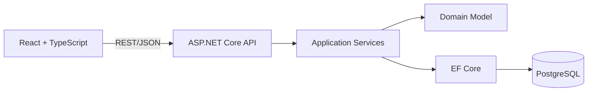
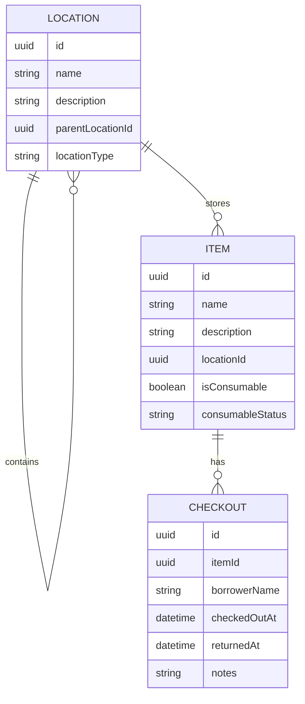

# Toolbox

> A self-hosted inventory system that tells you exactly where your things are.

Toolbox brings structure to household, workshop, and equipment storage. It
models real spaces as a hierarchy, connects every item to a storage container,
and records when an item leaves its usual home.

Instead of remembering that a torque wrench is "somewhere in the garage",
Toolbox gives a useful answer:

```text
House / Garage / Red Tool Chest / Drawer 2
```

The project is designed as a production-minded full-stack application with an
ASP.NET Core API, a React and TypeScript client, PostgreSQL persistence, and a
reproducible Docker Compose deployment.

> [!IMPORTANT]
> Toolbox is currently in V1 pre-release testing. Its core inventory, storage,
> checkout, and spatial-planning workflows are implemented and run through
> Docker Compose. See [Project status](#project-status) for the remaining V1
> release work and known limitations.

## Why Toolbox?

Generic inventory tools can record what you own, but they rarely model where
an object is stored with enough precision to help you find it. Toolbox treats
storage as a core domain concept rather than a free-text field.

- **Find items quickly:** search by name or description and see the complete
  storage path in each result.
- **Add ranges quickly:** create numbered sets such as `mm 1/4" sockets 10`
  through `mm 1/4" sockets 24` in one operation.
- **Model real spaces:** nest rooms, cabinets, shelves, boxes, and drawers to
  any depth.
- **Keep storage accurate:** move items and storage containers without rebuilding the
  surrounding hierarchy.
- **Track borrowed equipment:** check an item out to a named borrower and keep
  its full return history.
- **Own the data:** run the complete system on infrastructure you control.

## Core Workflows

### Locate an item

Search is the primary interaction. A result combines item details, availability,
and a calculated path through the storage hierarchy so the user can move directly
from a query to the physical object.

```text
Torque Wrench
Available | Consumable: no
House / Garage / Red Tool Chest / Drawer 2
```

### Organise a space

Storage containers use an arbitrary parent-child hierarchy. The model works equally well
for a single storage cupboard or a collection spanning a house, garage, loft,
and workshop. Items can be reassigned as the physical space changes.

### Check equipment out

A checkout records the borrower, time, and optional context. Returning the item
closes the active checkout rather than deleting it, preserving an auditable
history while making the item available again.

### Open a labelled storage container

Storage container QR labels are planned for V2. V1 focuses on the inventory, storage,
search, movement, and checkout workflows.

## Architecture

Toolbox uses a modular monolith. This keeps deployment and local development
simple while preserving explicit boundaries between the API, application
logic, domain model, and infrastructure.



The backend owns business rules such as hierarchy validation, path calculation,
item availability, and checkout state transitions. The frontend is responsible
for responsive search, browsing, and task-focused item and storage workflows.

### Technology

| Area | Technology |
| --- | --- |
| API | C# and ASP.NET Core |
| Domain and persistence | Entity Framework Core |
| Web client | React, TypeScript, and Vite |
| Database | PostgreSQL |
| Backend tests | xUnit |
| Deployment | Docker and Docker Compose |

### Repository layout

The current foundation follows this structure:

```text
toolbox/
|-- backend/
|   |-- src/             # API, application, domain, and persistence
|   `-- tests/           # Unit and integration tests
|-- frontend/            # React application
|-- docs/                # Product and technical documentation
|-- docker-compose.yml
|-- .env.example
`-- README.md
```

## Domain Model

The UI uses **Storage** for navigation and sections, **storage container** for
individual entities, and **Container** in compact controls. Rooms, buildings,
and nested shelves or drawers are all storage containers. The designer uses a
**Storage library**. Internal `Location` types, API routes, database fields, and
browser storage contracts retain their existing names; no data migration is needed.



- A **storage container** (`Location` in code) represents a physical space and may contain child containers
  and items.
- An **Item** belongs to one current storage container and exposes its calculated full
  storage path.
- A **Checkout** is an append-only record. An item may have at most one active
  checkout, while completed records remain available as history.

## API Design

The first release is defined around resource-oriented REST endpoints with
explicit commands for checkout state transitions.

| Method | Endpoint | Purpose |
| --- | --- | --- |
| `GET` | `/api/locations` | List storage containers |
| `POST` | `/api/locations` | Create a storage container |
| `GET` | `/api/locations/tree` | Retrieve the storage hierarchy |
| `GET` | `/api/locations/{id}` | Retrieve a storage container and its contents |
| `PUT` | `/api/locations/{id}` | Update or move a storage container |
| `DELETE` | `/api/locations/{id}` | Delete a storage container when valid |
| `GET` | `/api/items?search={query}` | Search and list items |
| `POST` | `/api/items` | Create an item |
| `POST` | `/api/items/quick-add` | Create a numbered range of items |
| `GET` | `/api/items/{id}` | Retrieve an item and its history |
| `PUT` | `/api/items/{id}` | Update or move an item |
| `DELETE` | `/api/items/{id}` | Delete an item |
| `POST` | `/api/items/{id}/checkout` | Check an item out |
| `POST` | `/api/items/{id}/checkin` | Return an item |

Request and response schemas will be versioned and documented alongside the
implemented API.

## Project Status

Toolbox has a working V1 vertical slice backed by ASP.NET Core, PostgreSQL, and
a responsive React client. The core V1 workflows are implemented:

- search and filter inventory by item name, container hierarchy, family, and tag;
- create individual items or numbered ranges;
- organise items with families, tags, and arbitrarily nested storage containers;
- move or update items while retaining their calculated full storage path;
- create, rename, move, colour, and recursively remove storage containers;
- check out one or many items to a named borrower with optional notes;
- review and filter currently available and checked-out items in a dedicated checkout page;
- check items back in while preserving checkout history;
- draw a simple floor plan and place storage containers on it; and
- run the frontend, API, and PostgreSQL together through Docker Compose.

The backend has migrations and automated domain coverage for hierarchy, search,
movement, deletion, and checkout rules. The frontend covers the primary
inventory, storage, and designer interactions. Before declaring V1 complete,
the project still needs continuous integration and final release verification.

### Space designer

The browser-based space designer supports walls, rectangles, doors, garage
doors, and windows. Plans include configurable units, scale, grid size, canvas
dimensions, snapping, zoom, undo/redo, and JSON export. Storage containers can
be placed from the Storage library, and inventory maps highlight an item's
mapped container or its nearest mapped parent.

The current plan is saved in browser local storage. It is not yet persisted to
PostgreSQL or shared between browsers and devices.

### Checkout workspace

The checkout page separates items that are ready to borrow from items away from
the toolbox. It supports search, multi-select checkout and check-in, direct
single-item checkout dialogs, borrower assignment, optional notes, and an
assignee column for checked-out items. Item pages also expose the active
borrower and retained checkout history.

### Known limitations

- There is no account, authentication, or permissions system.
- Space-designer plans are local to one browser and only export as JSON.
- Dedicated storage-container detail URLs are deferred; V1 uses hierarchical
  Container filters on the Inventory and checkout pages instead.
- Automated checks run locally, but a GitHub Actions CI workflow is not yet present.
- Item photos and general attachments are not implemented.
- QR storage-container labels are intentionally deferred to V2.
- The checkout model records a borrower name rather than assigning a user account.

The detailed implementation brief is available in
[`docs/INITIAL_BUILD.md`](docs/INITIAL_BUILD.md).

## Running Toolbox

The stack can be started with:

```bash
cp .env.example .env
docker compose up --build
```

The frontend is available at `http://192.168.10.116:7001/`, the API at
`http://192.168.10.116:5080`, and PostgreSQL at `192.168.10.116:5432`. In Development,
the API applies migrations and inserts demo data when the database is empty.
The frontend includes inventory search, nested storage, item creation and bulk
actions, quick-add ranges, tags, families, checkout/check-in, retained history,
and the local space designer.

For local development without Compose:

```bash
dotnet restore backend/Toolbox.sln
dotnet build backend/Toolbox.sln
dotnet test backend/Toolbox.sln
npm --prefix frontend install
npm --prefix frontend run lint
npm --prefix frontend run test
npm --prefix frontend run build
```

The backend exposes `GET /api/health/live`, `GET /api/health/ready`, and
`GET /api/status`. See [`backend/README.md`](backend/README.md) for migration
commands and connection-string configuration.

Toolbox local Vite development uses `http://192.168.10.116:5174/` and preview
uses port `4174`. Port `5173` is reserved for the separate portfolio
application. These local ports can be changed in `frontend/.env` using
`VITE_DEV_PORT` and `VITE_PREVIEW_PORT`.

The Docker host ports can be changed in the root `.env` using `WEB_PORT`,
`API_PORT`, and `POSTGRES_PORT`. The container-internal ports are fixed for
service-to-service communication.

## Engineering Priorities

- **Domain integrity:** prevent storage hierarchy cycles, invalid item moves, and
  duplicate active checkouts at the backend boundary.
- **Useful tests:** cover hierarchy traversal, path calculation, search, item
  movement, and the complete checkout lifecycle.
- **Operational simplicity:** provide migrations, health checks, environment
  templates, and a single Compose-based deployment path.
- **Mobile usability:** optimise common interactions for phone use in garages,
  workshops, and storage areas.
- **Focused scope:** complete and harden the core inventory, checkout, and
  lightweight spatial workflows before introducing accounts or automation.

## Roadmap

| Milestone | Outcome |
| --- | --- |
| Foundation | API and client scaffolding, PostgreSQL, migrations, and Compose |
| Inventory | Nested storage containers, item management, full paths, and search |
| Circulation | Checkout and return commands with retained history |
| Physical access | QR storage container labels and scan-led access in V2 |
| Spatial view | Local floor plans and visual storage container placement |
| Extensions | Authentication, attachments, barcode support, and offline options |

The map system is intentionally separated from the storage hierarchy. Its
placements use plan coordinates so layouts render across screen sizes without
coupling inventory records to a particular viewport.

## Scope

The initial release deliberately excludes complex permissions, OCR, AI image
recognition, purchasing and warranty management, offline synchronisation, and a
native mobile application. These features would add operational complexity
before the core find, organise, and checkout workflows have been validated.

## Contributing

Before contributing, read the [`project guidance`](docs/AGENTS.md) and the
[`initial build specification`](docs/INITIAL_BUILD.md). Keep domain behaviour
outside controllers and UI components, include tests for business rules, and
run the relevant builds and test suites before submitting a change.

Use small, descriptive commits. Never commit generated output, credentials, or
local environment files.

## License

No open-source license has been selected. Until a license is added, all rights
are reserved.
